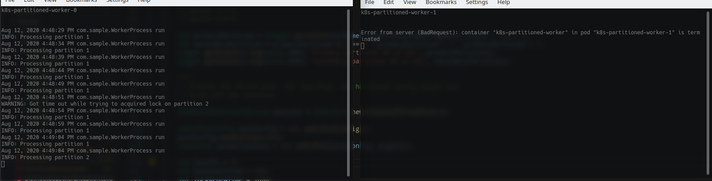

# Kubernetes Partitioned Worker with Redis

This is an example on how to build a partitioned batch worker for a Kubernetes cluster in Java with Redis.

## Problem statement

Suppose a continuous batch worker should be built on top of a single data set in the same data source, for example: make data transformation over a database table, or picking up scheduled items in the cache. Running a single instance of that worker would be simple enough, but only one record at a time could be processed. Multi-threading will definitely help, but how can it be scaled to more than one server? Now suppose your worker is able to process 500 transactions per second in a single host, and you want to increase it to 1,000 TPS. Logic says adding one more worker would do, but then they would be processing the same data set at the same time, which will end up with a concurrency problems or duplicated processing, with potentially no gain.

If using a message broker, the problem could be solved in the broker itself (such as Kafka partitions), but as the current scenario doesn't include the use of a queue or topic, there is nothing between the worker and the database to know what data that worker should process.

## Solution

The solution was to create multiple replicas of the worker and make each of them work on a different "chunk" of information, or "partition". The concept is similar to sharding, for example: worker1 will only process transactions related to Canada customers, whereas worker2 will only process US transactions. So worker1 is responsible for partition CA and worker2 for partition US. Assuming US and Canada produce the same amount of transactions, the work will be split between the workers. 

## Demand Surge

Unfortunately, the pattern does not deal with a sudden rise in the number of items for a specific partition, meaning the performance level for that partition will bump into the worker's compute resources. 

## Failover

Having one worker per partition is risky, since if it fails, then a good chunk of information won't get processed. To solve this, the code has the concept of primary and secondary partition, meaning that a worker will be mainly focused on processing its primary partition, but always ready to process the secondary partition if the main worker of that partition fails. 

For example, let's say we have a couple of workers:

- worker1, primary partition: 1, secondary partition: 2, host: server1
- worker2, primary partition: 2, secondary partition: 1, host: server2

In a regular, healthy environment, worker1 will always process partition 1, and worker2 always processes partition 2. Now suppose server2 goes down. What must happen is that worker1 will take both partition 1 and 2, and, as soon as worker2 comes back online, it starts processing partition 2 again, so worker1 can release partition 2 and focus only on partition 1.

However, how is worker1 to know that worker2 stopped processing those items? Seems like RPC communication would solve it, but it would mean more complexity, exposing ports, standing up tiny RPC server threads (with gRPC, let's say), but turns out there is a better solution if a shared memory cluster is at hand (such as Memcache or Redis): building a distributed locking system.

### Failover and Locking

The idea is simple: mimic a regular multi-thread locking mechanism (```lock``` keyword for C#, ```synchronized``` in java or any Mutex implementation) on a distributed cross-process, cross-server system. That way, worker1 would acquire a persistent lock over partition 1, and worker2 over partition 2. In turn, worker1 will continuously try to acquire a short-lived lock on partition 2. Worker2 will never release the lock on partition 2 unless it goes down. In that case, as the worker1 is constantly trying to get the lock on partition 2, it will soon acquire the lock, process it and release the lock as soon as possible, so that whenever worker2 comes back online, the lock will be released for it to acquire a persistent lock again.

### Distributed Locker Implementation

The distributed locker algorithm implementation reference can be found [here](https://redislabs.com/ebook/part-2-core-concepts/chapter-6-application-components-in-redis/6-2-distributed-locking/6-2-3-building-a-lock-in-redis/). Notice that the implementation only works on a single master Redis deployment. For a multi-master locking algorithm, see the Redlock approach [here](https://redis.io/topics/distlock).

## Kubernetes Deployment

We opted to use a Kubernetes StatefulSet, since it gives each POD a fixed name (example: worker-0, worker-1 etc) which can be used to infer the partition name. A Cronjob could be used, however we would need to have one Cronjob, with a different name, per partition - with Helm it could be done dynamically, but the StatefulSets seem to be better suited.

## Working example

Running the solution, we expect 3 things to happen:
1. In a healthy environment, each worker only processes its primary partition data.
2. If a worker goes down, someone takes over its partition.
3. When a worker comes back online, it takes back the ownership of the partition.

This first image shows the condition 1:


k8s-partitioned-worker-0 is primarily concerned about partition 1, and k8s-partitioned-worker-1 about partition 2. Both are only processing their corresponding primary partition. Notice they are getting timeout while trying to acquire the lock on the secondary partition: that is expected, since that partition will never be released, as long as all the pods are healthy.

The picture below illustrates what happens when k8s-partitioned-worker-1 gets deleted (kubectl delete pod):



k8s-partitioned-worker-0 immediately takes over partition 2, so now it is processing both partitions. After sometime, when k8s-partitioned-worker-1 comes back online, k8s-partitioned-worker-0 releases partition 2 and life comes back to normal:


## Code & Solution

This is a Java Maven project, so the source files are located under /src folder, with the pom.xml file in the root. For simplicity and readability, there is no layer separation, so all classes are located under /src/main/java/com/sample. Here is the class list:

- App.java: application entrypoint, starts Redis connection and kicks-off the worker threads.
- WorkerProcess.java: the worker timer task, where the worker logic resides.
- DistributedLocker.java: Redis locker implementation.
- DistributedLockerException.java: generic locker exception.

For a production-ready code, we recommend the use of separated layers for business logic (service classes or domain models) and data access (repository, data mapper and so on), and, of course, removing the hard-coded configurations.

## Build & Run

To run the application locally, the following dependencies are required:
- Java 12 or newer
- Maven 3 or newer
- Redis cluster up and running (could be local)

To run it, just use the following command line:
```bash
mvn clean package exec:java  -Dexec.args="localhost"
```
*Change "localhost" to your Redis cluster address. Notice that the solution relies on a StatefulSet host name, meaning it should end with "-[a number]" (e.g.: worker-1), and it will fail if that pattern is not followed. If your host name doesn't use that pattern, just change the App.java file, but don't forget to revert the changes before deploying it to Kubernetes.*

## Deployment

The solution is prepared for a Kubernetes deployment, so 2 steps should be taken to run it in a cluster.

### 1. Build and push image

After building the solution with maven, the Docker image should be built. Of course, you will need Docker for it:

```bash
docker build -t k8s-partitioned-worker .
```

Next step is to push the image to your private repository (e.g.: Azure Container Registry). 

### 2. Deploy Helm Chart

Before moving on, make sure your Kubernetes cluster is attached to your private registry. For a Azure Kubernetes Service, you can easily do that by running ```az aks update -n [cluster name] -g [rg name] --attach-acr [acr name]```. If you don't have that alternative, a change in the Kubernetes deployment template may be necessary (for adding a secret reference for image pulling), so go on and change the ./helm-chart/templates/statefulset.yml.

As the solution uses a Helm chart, Helm 3 or above should be installed in your local environment. After that, connect your kubectl to the cluster and run the following command in the root folder of the project:

```bash
helm upgrade --install --set imageName=[registry address]/[image name from step 1] k8s-partitioned-worker ./helm-chart/
```

